# Optoelectronics

The project provides an explanation of photonic devices and semiconductor optoelectronics. For details please click on the executable in 
https://github.com/alpaddesai/Optoelectronics/releases.  Company confidential information is not displayed. All images are custom 
by Alpa D Desai. 

## Optoelectronics
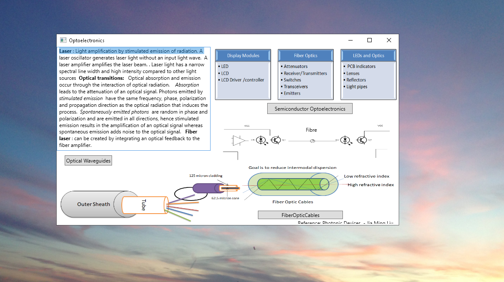

## Semiconductor optoelectronics
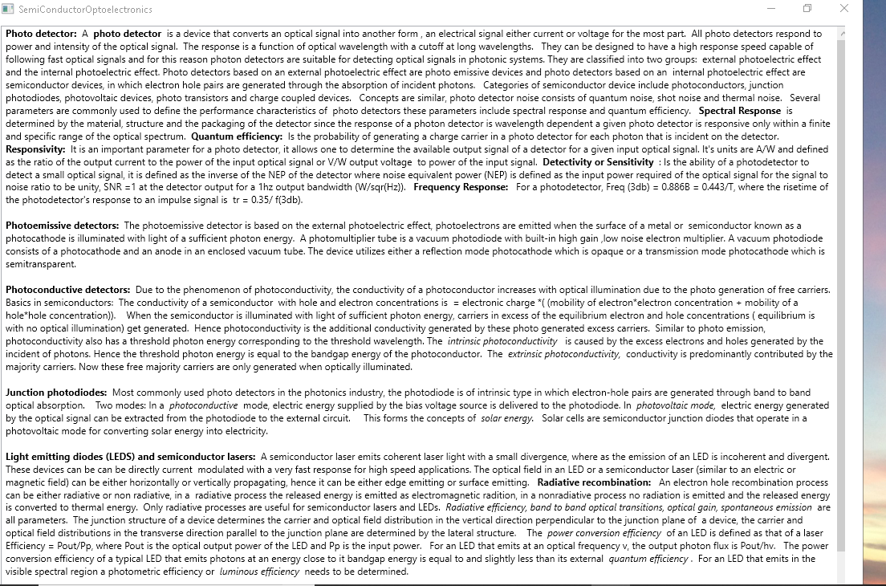

## Fiber Optic Cables
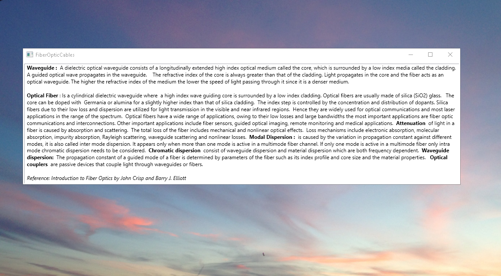

## Semiconductor Lasers
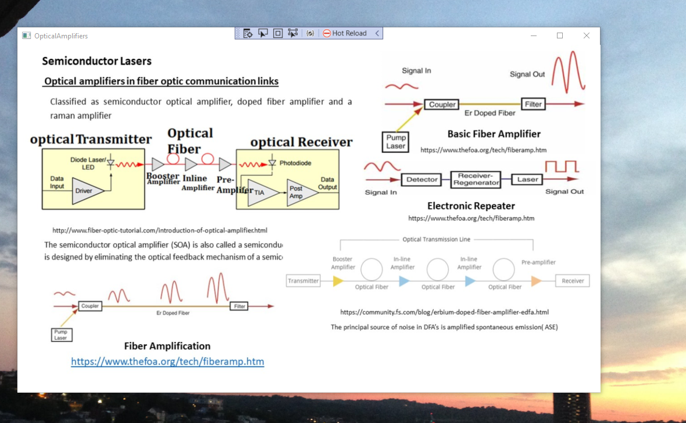

## Laser Amplifiers
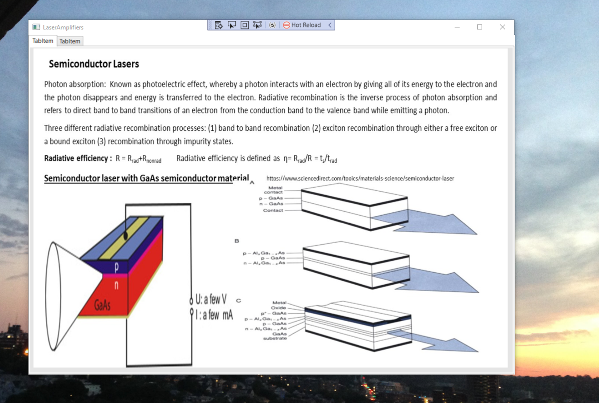

## Laser Amplifiers
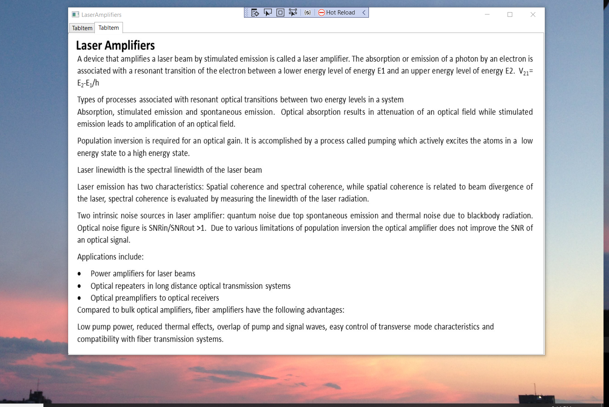

## Optical Resonators
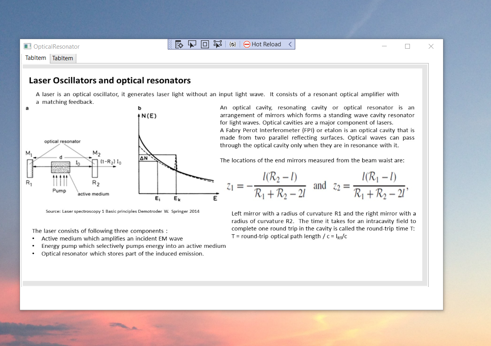

## Laser Oscillators
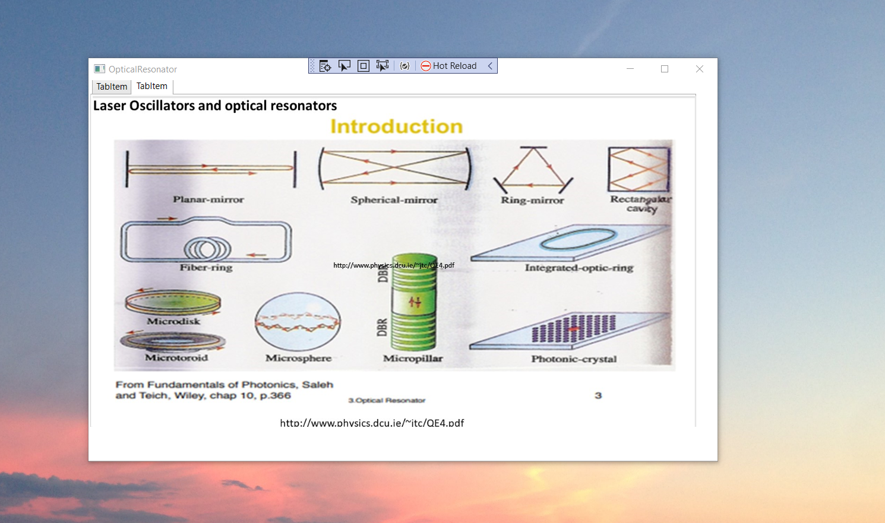

## Optic Devices
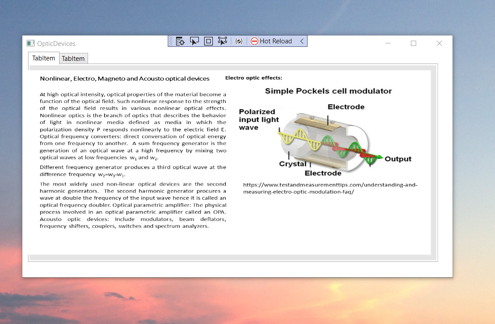

## Optic Devices
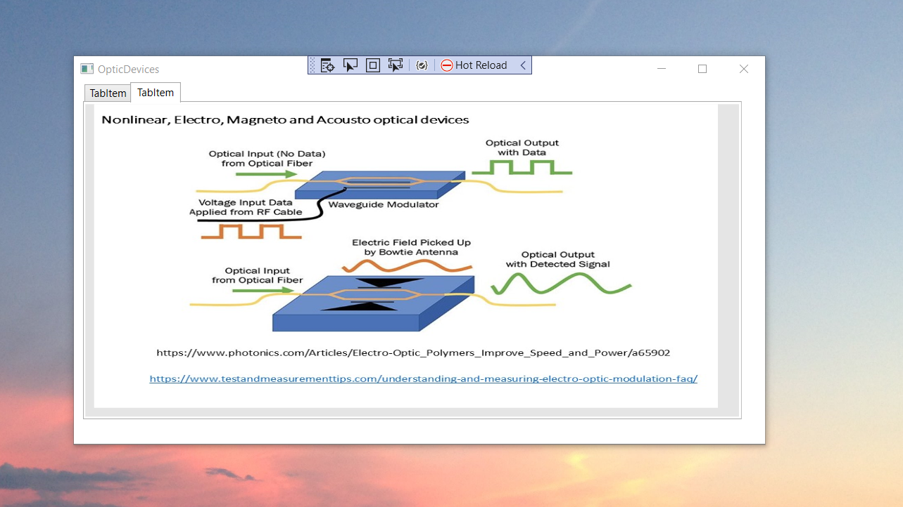

## Photo Diodes
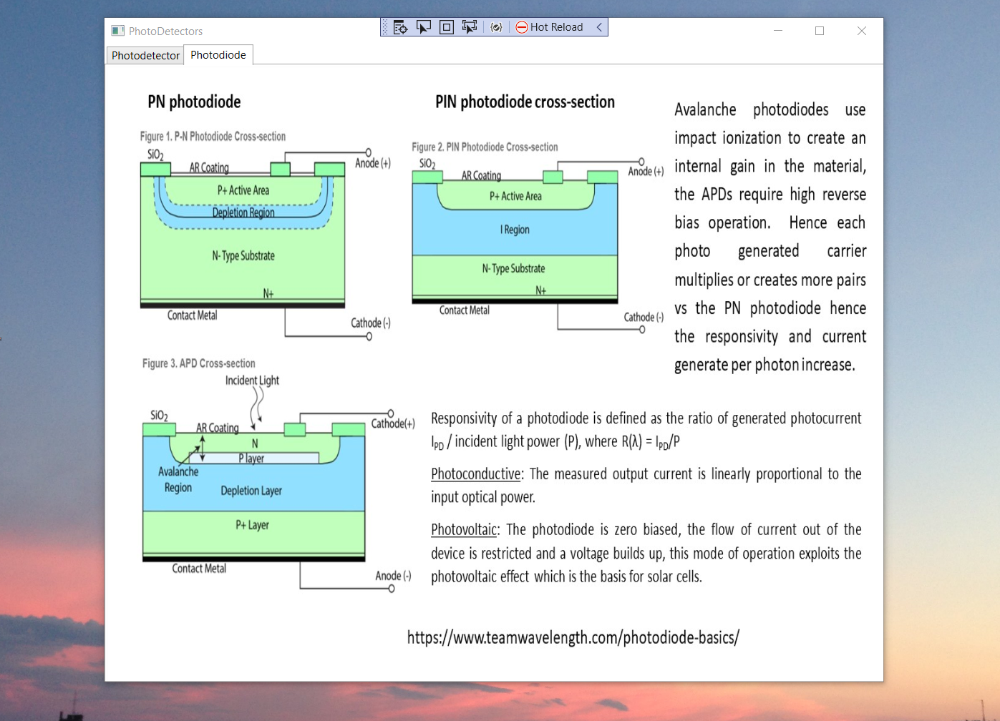

## Photo Detectors
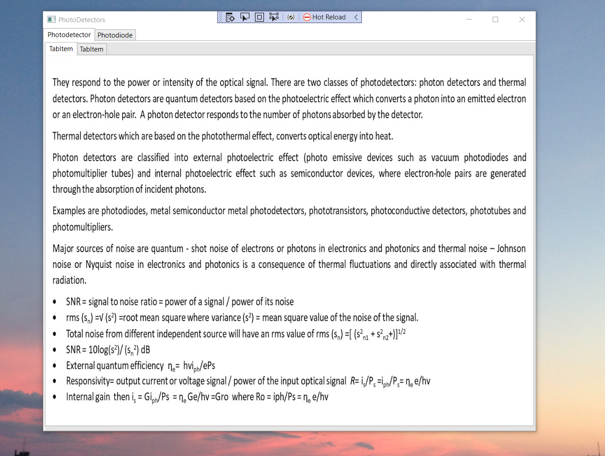

## Photo Detectors
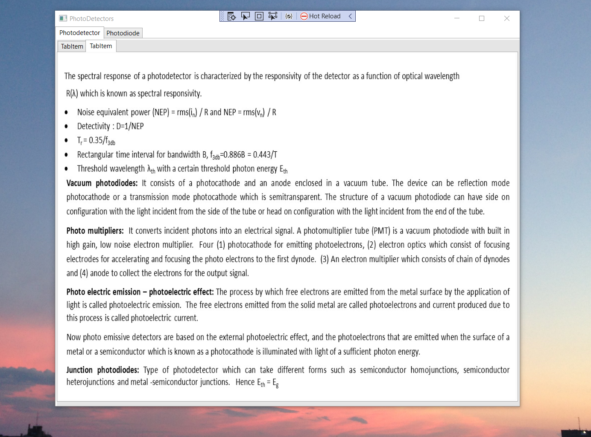

Additional details https://github.com/alpaddesai/MSEE_EngineeringProjectManagement

